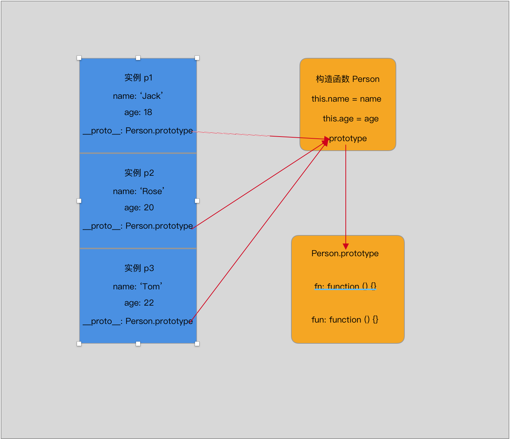
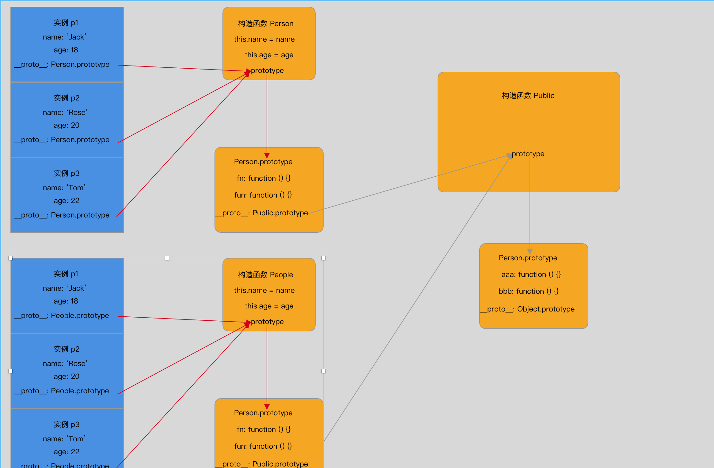

# 闭包

- 闭包是我们函数的一种高级使用方式
- 在聊闭包之前我们要先回顾一下 **函数**


## 函数的两个阶段

- 我们一直说函数有两个阶段
  1. 定义阶段
  2. 调用阶段


### 函数定义阶段

1. 开辟一个 **存储空间**
2. 把函数体内的代码一模一样的放在这个空间内（不解析变量）
3. 把 **存储空间** 的地址给函数名


### 函数调用阶段

1. 按照函数名的地址找到函数的 **存储空间**
2. 形参赋值
3. 预解析
4. 将函数 **存储空间** 中的代码拿出来执行（才解析变量）


### 重新定义函数调用阶段

1. 按照函数名的地址找到函数的 **存储空间**

2. 形参赋值

3. 预解析

4. 在内存中开辟一个 **执行空间**

5. 将函数 **存储空间** 中的代码拿出来在刚刚开辟的 **执行空间** 中执行

6. 执行完毕后，内存中开辟的 **执行空间** 销毁

   ```javascript
   function fn() {
     console.log('我是 fn 函数')
   }
   
   fn() 
   ```

   - 函数执行的时候会开辟一个 **执行空间** （我们暂且叫他 `xxff00`）
   - `console.log('我是 fn 函数')` 这个代码就是在 `xxff00` 这个空间中执行
   - 代码执行完毕以后，这个 `xxff00` 空间就销毁了


## 函数执行空间

- 每一个函数会有一个 **存储空间**
- 但是每一次调用都会生成一个完全不一样的 **执行空间**
- 并且 **执行空间** 会在函数执行完毕后就销毁了，但是 **存储空间** 不会
- 那么这个函数空间执行完毕就销毁了，还有什么意义呢？
  - 我们可以有一些办法让这个空间 **不销毁**
  - **闭包**，就是要利用这个 **不销毁的执行空间**


### 函数执行空间不销毁

- 函数的 **执行空间** 会在函数执行完毕之后销毁

- 但是，一旦函数内部返回了一个 **引用数据类型**，并且 **在函数外部有变量接受** 的情况下

- 那么这个函数 **执行空间** 就不会销毁了

  ```javascript
  function fn() {
    const obj = {
        name: 'Jack',
        age: 18,
        gender: '男'
    }
    
    return obj
  }
  
  const o = fn()
  ```

  - 函数执行的时候，会生成一个函数 **执行空间** （我们暂且叫他 `xxff00`）
  - 代码在 `xxff00` 空间中执行
  - 在 `xxff00` 这个空间中声名了一个 对象空间（`xxff11`）
  - 在 `xxff00` 这个执行空间把 `xxff11` 这个对象地址返回了
  - 函数外部 `0` 接受的是一个对象的地址没错
    - 但是是一个在 `xxff00` 函数执行空间中的 `xxff11` 对象地址
    - 因为 `o` 变量一直在和这个对象地址关联着，所以 `xxff00` 这个空间一直不会销毁
  - 等到什么时候，执行一句代码 `o = null`
    - 此时， `o` 变量比在关联在 `xxff00` 函数执行空间中的 `xxff11` 对象地址
    - 那么，这个时候函数执行空间 `xxff00` 就销毁了


## 闭包

- 闭包就是利用了这个函数执行空间不销毁的逻辑
- 有几个条件组成闭包


### 不销毁的空间

- 闭包的第一个条件就是利用了不销毁空间的逻辑

- 只不过不是返回一个 **对象数据类型**

- 而是返回一个 **函数数据类型**

  ```javascript
  function fn() {
      
    return function () {}
  }
  
  const f = fn()
  ```

  - `f` 变量接受的就是一个 **fn的执行空间** 中的 函数


### 内部函数引用外部函数中的变量

- 涉及到两个函数

- 内部函数要查看或者使用着外部函数的变量

  ```javascript
  function fn() {
    const num = 100
    
    // 这个函数给一个名字，方便写笔记
    return function a() {
      console.log(num)
    }
  }
  
  const f = fn()
  ```

  - `fn()` 的时候会生成一个 `xxff00` 的执行空间
  - 再 `xxff00` 这个执行空间内部，定义了一个 `a` 函数的 **存储空间** `xxff11`
  - 全局 f 变量接受的就是 `xxff00` 里面的 `xxff11` 
  - 所以 `xxff00` 就是不会销毁的空间
  - 因为 `xxff00` 不会销毁，所以，定义再里面的变量 num 也不会销毁
  - 将来 `f()` 的时候，就能访问到 num 变量


### 闭包的特点

- 为什么要叫做特点，就是因为他的每一个点都是优点同时也是缺点
  1. 作用域空间不销毁
     - 优点： 因为不销毁，变量页不会销毁，增加了变量的生命周期
     - 缺点： 因为不销毁，会一直占用内存，多了以后就会导致内存溢出
  2. 可以利用闭包访问再一个函数外部访问函数内部的变量
     - 优点： 可以再函数外部访问内部数据
     - 缺点： 必须要时刻保持引用，导致函数执行栈不被销毁
  3. 保护私有变量
     - 优点： 可以把一些变量放在函数里面，不会污染全局
     - 缺点： 要利用闭包函数才能访问，不是很方便


### 闭包概念（熟读并背诵全文）

- 有一个 A 函数，再 A 函数内部返回一个 B 函数
- 再 A 函数外部有变量引用这个 B 函数
- B 函数内部访问着 A 函数内部的私有变量
- 以上三个条件缺一不可

 

# 继承

- 继承是和构造函数相关的一个应用
- 是指，**让一个构造函数去继承另一个构造函数的属性和方法**
- 所以继承一定出现在 **两个构造函数之间**


### 一个小例子

- 我们之前说，构造函数（类）是对一类行为的描述
- 那么我们类这个概念其实也很抽象
- 比如：
  - 我们说 `国光` / `富士` 都是 苹果的品种，那么我们就可以写一个 `苹果类` 来实例化很多品种出来
  - 而 `苹果` / `梨` 这些东西都是水果的一种，那么我们就可以写一个 `水果类`
  - 说过的统一特点就是 `甜` / `水分大` ，而不同的水果有不同的特征
  - 那么我们就可以让 `苹果类` 来继承 `水果类` 的内容，然后再用 `水果类` 去实例化对象
  - 那么实例化出来的就不光有 `苹果类` 的属性和方法，还有 `水果类` 的属性和方法


### 继承的作用

- 其实说到底，到底什么是继承

- 我们之前说，在我们书写构造函数的时候，为了解决一个函数重复出现的问题

- 我们把构造函数的 **方法** 写在了 `prototype` 上

  

- 这样，每一个实例使用的方法就都是来自构造函数的 `prototype` 上

- 就避免了函数重复出现占用内存得到情况

- 那么，如果两个构造函数的 prototype 中有一样的方法呢，是不是也是一种浪费

- 所以我们把构造函数䣌 prototype 中的公共的方法再次尽心提取

  

- 我们准备一个更公共的构造函数，让构造函数的 `__proto__` 指向这个公共的构造函数的 `prototype` 


### 常见的继承方式

- 我们有一些常见的继承方式来实现和达到继承的效果

- 我们先准备一个父类（也就是要让别的构造函数使用我这个构造函数的属性和方法）

  ```javascript
  function Person() {
      this.name = 'Jack'
  }
  
  Person.prototype.sayHi = function () {
      cosnole.log('hello')
  }
  ```

- 这个 `Person` 构造函数为父类

- 让其他的构造函数来继承他

- 当别的构造函数能够使用他的属性和方法的时候，就达到了继承的效果


#### 原型继承

- 原型继承，就是在本身的原型链上加一层结构

  ```javascript
  function Student() {}
  Student.prototype = new Person()
  ```


#### 借用构造函数继承

- 把父类构造函数体借用过来使用一下而已

  ```javascript
  function Student() {
    Person.call(this)
  }
  ```

  

#### 组合继承

- 就是把 `原型继承` 和 `借用构造函数继承` 两个方式组合在一起

  ```javascript
  function Student() {
    Person.call(this)
  }
  Student.prototype = new Person
  ```

  

### ES6 的继承

- es6 的继承很容易，而且是固定语法

  ```javascript
  // 下面表示创造一个 Student 类，继承自 Person 类
  class Student extends Person {
      constructor () {
          // 必须在 constructor 里面执行一下 super() 完成继承 
          super()
      }
  }
  ```

- 这样就继承成功了